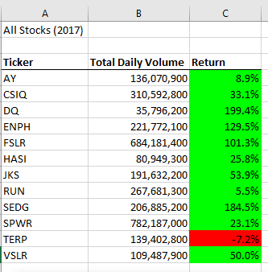
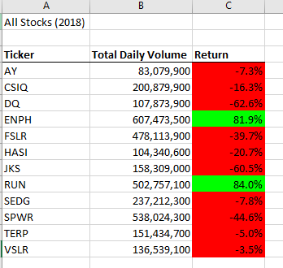

# VBA of Wall Street 
Performing analysis on Wall Streets Tickers and reviewing their respective amount of volume traded for the years of 2017 and 2018.  We are also looking at stock performance for each year analyzed as well. 
 
**VBA Challenge  **

**Overview of Project  **
**Purpose **
 
Steve loves stock data and he especially loves the Macro that we have created for him today.  But with every great thing, we can always dig deeper to find one more step of greatness. 
 
Steve wants to do a deep dive on stocks over the last two years with a focus on 12 specific stocks.  The trick, and benefit, about this analysis is that is can be ever growing and that is right in the wheelhouse for Microsoft – Visual Basic.  For this analysis, we are looking over the years of 2017 and 2018 with a microscopic focus on the volume that the stock has traded as well as the return for that individual (and all) stocks.  What is great about the code that has been written is that we can add to the data in the years to come and the macro will still be very much relevant and powerful. 
 
Let’s begin.  
 
**Results  **
**Stock Performance  **
As soon as Steve executes the Macro, he is going to wish it was 2017 all over again.  Thanks to our code, the stocks were in the money due to the green color format we applied.  After the initial shock of how the color changes between 2017 and 2018, Steve should really explore and understand the stock ticker: ENPH.  In year 2017, the return was 129.5% with a heavy volume total of 221,772,100.  If we took a trip back to our Module about Excel, we could bring in the average volume as well as where did ENPH rank that year in total daily volume traded for all 12 stocks.  The average of the total daily volume traded that year was 263,886,592.  That puts ENPH a little below the average total daily volume traded but if you look at where it ranked for all 12 stocks, it was the fifth highest traded stock at 7% of all total daily volume for 2017.  It makes you wondered if that analysis was done in 2017 because 2018 was a year improved for ENPH with almost triple the total daily volume traded but half of the return coming back to the investor in 2018.  Still, ENPH was in the money both years.  The only other stock that can claim being in the money for both years would be stock ticker RUN, and that is exactly what it did with its total daily volume and return in 2018. 
 

 
 
 
 
**Execution Time of Scripts - Original vs. Refactored  **
 
**2017 Refactored Execution Time of Script **
 
 
 
**2017 Original Execution Time of Script **
 
 
 
**2018 Refactored Execution Time of Script **
 
 
 
**2018 Original Execution Time of Script **
 
 

