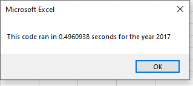
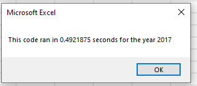
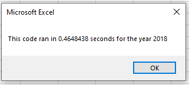
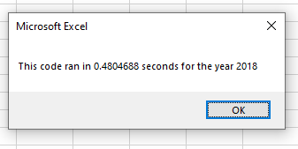

# VBA of Wall Street 
Performing analysis on Wall Streets Tickers and reviewing their respective amount of volume traded for the years of 2017 and 2018.  We are also looking at stock performance for each year analyzed as well. 
 
**VBA Challenge  **

**Overview of Project  **
**Purpose **
Steve loves stock data and he especially loves the Macro that we have created for him today.  But with every great thing, we can always dig deeper to find one more step of greatness. 
 
Steve wants to do a deep dive on stocks over the last two years with a focus on 10 specific stocks.  The trick, and benefit, about this analysis is that is can be ever growing and that is right in the wheelhouse for Microsoft – Visual Basic.  For this analysis, we are looking over the years of 2017 and 2018 with a microscopic focus on the volume that the stock has traded as well as the return for that individual (and all) stocks.  What is great about the code that has been written is that we can add to the data in the years to come and the macro will still be very much relevant and powerful. 
 
Let’s begin.  
 
 
 
 
 
 
 
 
 
 
 
 
 
