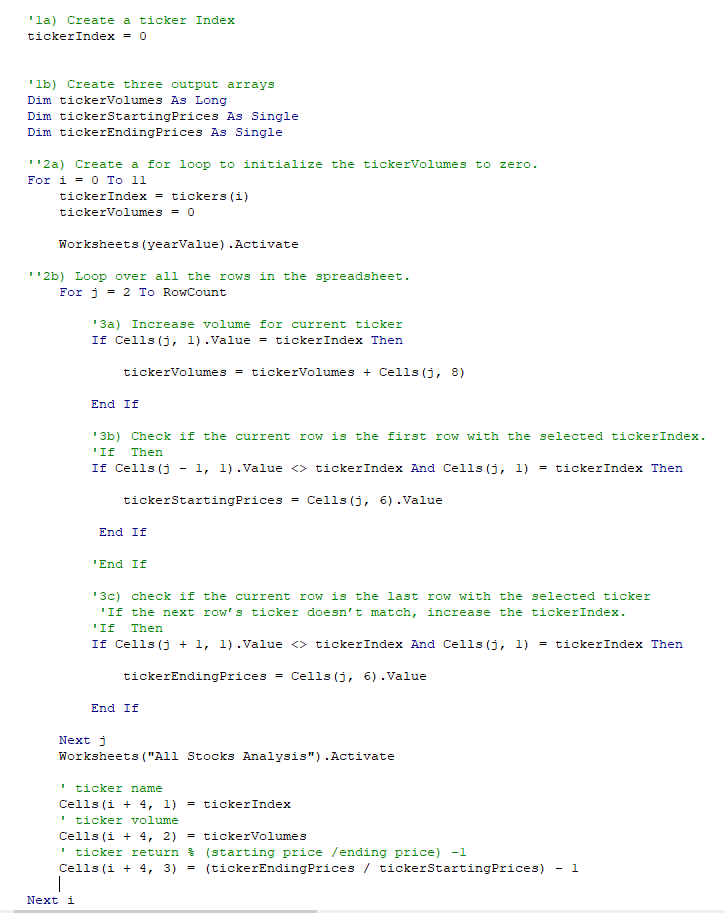

# VBA of Wall Street 
Performing analysis on Wall Streets Tickers and reviewing their respective amount of volume traded for the years of 2017 and 2018.  We are also looking at stock performance for each year analyzed as well. 
 
**VBA Challenge  **

**Overview of Project  **
**Purpose **
 
Steve loves stock data and he especially loves the Macro that we have created for him today.  But with every great thing, we can always dig deeper to find one more step of greatness. 
 
Steve wants to do a deep dive on stocks over the last two years with a focus on 12 specific stocks.  The trick, and benefit, about this analysis is that is can be ever growing and that is right in the wheelhouse for Microsoft – Visual Basic.  For this analysis, we are looking over the years of 2017 and 2018 with a microscopic focus on the volume that the stock has traded as well as the return for that individual (and all) stocks.  What is great about the code that has been written is that we can add to the data in the years to come and the macro will still be very much relevant and powerful. 
 
Let’s begin.  
 
**Results  **
**Stock Performance  **
As soon as Steve executes the Macro, he is going to wish it was 2017 all over again.  Thanks to our code, the stocks were in the money due to the green color format we applied.  After the initial shock of how the color changes between 2017 and 2018, Steve should really explore and understand the stock ticker: ENPH.  In year 2017, the return was 129.5% with a heavy volume total of 221,772,100.  If we took a trip back to our Module about Excel, we could bring in the average volume as well as where did ENPH rank that year in total daily volume traded for all 12 stocks.  The average of the total daily volume traded that year was 263,886,592.  That puts ENPH a little below the average total daily volume traded but if you look at where it ranked for all 12 stocks, it was the fifth highest traded stock at 7% of all total daily volume for 2017.  It makes you wondered if that analysis was done in 2017 because 2018 was a year improved for ENPH with almost triple the total daily volume traded but half of the return coming back to the investor in 2018.  Still, ENPH was in the money both years.  The only other stock that can claim being in the money for both years would be stock ticker RUN, and that is exactly what it did with its total daily volume and return in 2018. 
 

 
 
 
 
**Execution Time of Scripts - Original vs. Refactored  **
 
My theory would have been that the refactored code would run slow because we added formatting to the code whereas in the Run Analysis code that we refactored, it was not engrained in the button process.  We coded the formatting in a separate exercise and whe we refactored, we added the formatting within the subroutine.  2017 was able to hold my theory true but not for 2018.  I would have to guess that I ran the refactored code more than the original code before I took the screenshots that would have allowed Excel and VBA to process the refactored code more quickly.  Looks like that matters in VBA and the Olympics - ever hundredths and thousandths of a second counts and could be the difference between a gold medal or silver medal. 
 
**2017 Refactored Execution Time of Script **
 
 
 
**2017 Original Execution Time of Script **
 
 
 
**2018 Refactored Execution Time of Script **
 
 
 
**2018 Original Execution Time of Script **
 
 
 
 
 
**Summary** 
 
**What are the advantages or disadvantages of refactoring code?** 
 
The first thing that jumps to mind is the advantage of time saved with refactoring code.  If you are working on similar outputs and data sets while just needing to make a few edits or changes here and there, refactoring is going to save you time.  And when we are looking at stock analysis – time is money and the more you have of time, hopefully it results in more money.   As you stay within the code and grow it, the code should evolve into a better code and allow you to grow as a coder as well.  I could see it also being a great source of communication with the coding community as it will engage feedback, conversation and improvement that would allow the code to grow with responsibility. 
 
But that will lead you straight into a disadvantage of refactoring code.  If you did not create the code and do not understand what the code is trying to do or accomplish, you are going to create more problems than any amount of time you think you are going to save with the short cuts.  Beautiful codes come from beautiful minds.  It is not the lines that make the code work; it is the time that has been spent understanding and mapping out the purpose of the code you are about to undertake and truly defining the why behind the code. 
 
**How do these pros and cons apply to refactoring the original VBA script?** 
 
For me, the pros of refactoring this code was that I experienced an ever so slight advantage with having to refactor only a portion with the All Stocks Analysis Marco we wrote in the earlier stages of the Module.  I could refer to the module and rethink through my steps while mapping out how we created or why I typed a specific line in the code and Macro process.  It saved me time because it allowed for me to focus on the Module requirements within the grading rubric, but it did not make me a better coder.  Reason being is because I have not had enough practice with VBA or codes that would allow me to jump to the refactoring process without forming my foundation. 
 
With that being said, I do believe being an extreme beginner in VBA did allow me to fail and communicate with my TA’s and tutor, which in turn, made me develop my skills, understanding and code.  I would not take on tomorrow with this code because I am not at a point that I would truly need to apply a refactoring code in day to day business.  I need to be going over code and creating it from the beginning, step by step so that I can eventually evolve into being able to refactor code after making a connection of how to use it in my line of work. 
 
I appreciate your time and thoughts while reviewing and grading the VBA Module Challenge. I look forward to your feedback and hope you have a great day.

